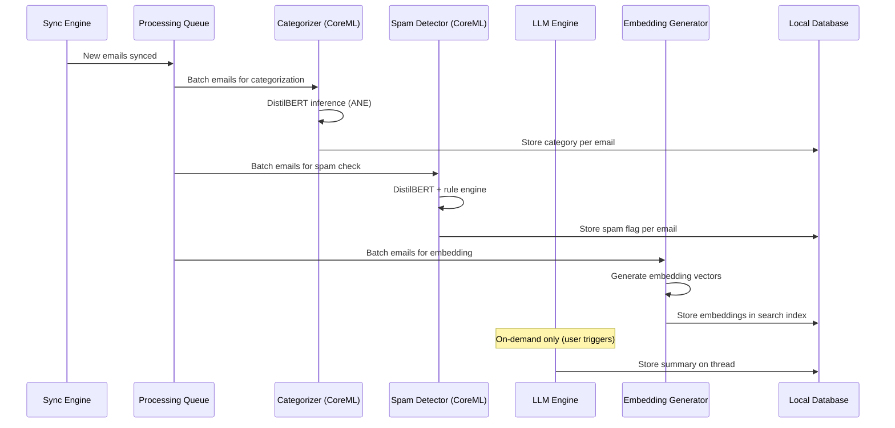
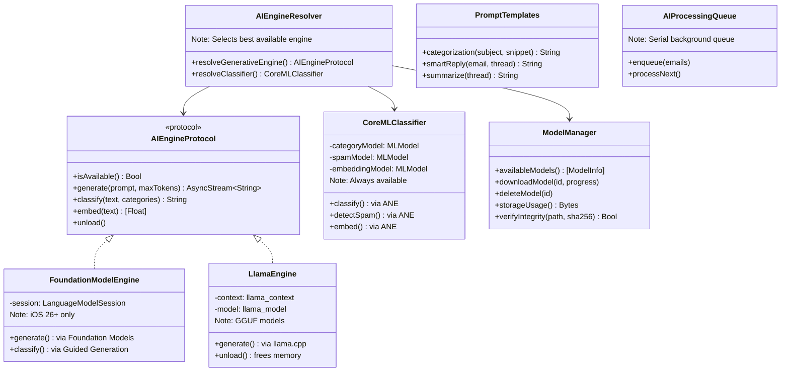

# Specification: AI Features

> The key words **MUST**, **MUST NOT**, **REQUIRED**, **SHALL**, **SHALL NOT**, **SHOULD**, **SHOULD NOT**, **RECOMMENDED**, **MAY**, and **OPTIONAL** in this document are to be interpreted as described in RFC 2119.

## 1. Summary

This specification defines all AI-powered features for the privacy-first email client: the tiered on-device inference engine, email categorization, smart reply generation, thread summarization, spam/phishing detection, and the semantic search embedding pipeline. **All AI processing runs entirely on-device** (Constitution P-03). No user data is ever sent to remote AI services.

The architecture uses a **tiered model strategy** to maximize device coverage:
- **Tier 1 (iOS 26+):** Apple Foundation Models — zero download, OS-managed 3B model
- **Tier 2 (iOS 18–25):** llama.cpp with GGUF models for generative tasks + CoreML DistilBERT for classification
- **Tier 3 (low-memory devices):** Smaller quantized models with graceful degradation

---

## 2. Goals and Non-Goals

### Goals

- Tiered on-device AI inference (Foundation Models → llama.cpp → CoreML)
- Automatic email categorization into 5 categories
- On-device spam and phishing detection
- Contextual smart reply suggestions (up to 3)
- Thread summarization (2-4 sentences)
- Semantic search via locally generated embeddings
- Graceful degradation when AI model is not available or device is underpowered
- Protocol-based engine abstraction enabling runtime swaps without domain/presentation changes

### Non-Goals

- Cloud-based AI inference (violates P-01, P-02, P-03)
- On-device model fine-tuning
- Custom user-trained categories
- Image or attachment content analysis (text-only in V1)

---

## 3. Functional Requirements

### FR-AI-01: Engine Requirements

- The AI engine **MUST** expose a protocol-based interface (`AIEngineProtocol`) so the underlying runtime can be swapped without changes outside the Data layer (Constitution AI-03).
- The engine **MUST** support a tiered runtime strategy:
  - **Tier 1:** Apple Foundation Models framework (iOS 26+, macOS 26+) when available
  - **Tier 2:** llama.cpp with GGUF quantized models (all supported platforms)
  - **Tier 3:** CoreML encoder models for classification tasks (all supported platforms)
- Runtime selection **MUST** be automatic based on platform capabilities and device constraints.
- For Tier 2 (llama.cpp): models **MUST** be downloaded post-install, not bundled in the app binary, as they exceed the 200 MB bundling limit (Constitution LG-01).
- For Tier 3 (CoreML): classification models **MAY** be bundled in the app binary since they are small (< 150 MB).
- The client **MUST** display download progress and allow the user to cancel (Tier 2 models).
- The client **MUST** function without AI features if no model is available (graceful degradation).
- The client **MUST** allow the user to delete downloaded models to reclaim storage.
- The client **MUST** display model license information in Settings → About → AI Model Licenses (Constitution LG-01).

### FR-AI-02: Email Categorization

- The client **MUST** categorize each email into one of: Primary, Social, Promotions, Updates, Forums.
- Categorization **MUST** run locally.
- Categorization **SHOULD** use the fastest available method:
  - **Preferred:** Fine-tuned DistilBERT via CoreML/ANE (< 5ms per email)
  - **Fallback:** LLM-based classification via Foundation Models or llama.cpp
- Categorization **SHOULD** run in the background after sync completes.
- Categorization results **MUST** be cached locally (stored on the Email/Thread entity).
- The client **SHOULD** allow users to manually re-categorize an email (override AI decision).
- Re-categorization **SHOULD** be stored locally as preference signals for future improvements.

### FR-AI-03: Smart Reply

- The client **MUST** generate up to 3 short reply suggestions for a given email.
- Suggestions **MUST** be contextually relevant to the email content.
- Suggestions **SHOULD** vary in tone (e.g., affirmative, declining, follow-up question).
- Generation **MUST** complete within 8 seconds (hard limit per NFR-AI-03). Target: < 2 seconds on Foundation Models, < 5 seconds on llama.cpp.
- Generation **MUST** run asynchronously; UI **MUST NOT** block while generating.
- Smart replies are generated on-demand and **MUST NOT** be persisted (Foundation spec Section 5.2).

### FR-AI-04: Thread Summarization

- The client **MUST** generate a concise summary (2-4 sentences) for any email thread.
- Summarization **MUST** be triggered on demand (user taps "Summarize") or automatically for threads with 3+ messages.
- Summaries **MUST** be cached locally on the Thread entity.
- The summary **MUST** capture: key decisions, action items, and the latest status.

### FR-AI-05: Semantic Search Embeddings

- The client **MUST** support natural language search queries across all synced emails.
- Search **MUST** use locally generated embeddings for semantic matching.
- Embeddings **MUST** be generated and stored locally during the indexing phase of sync.
- The search index **MUST** update incrementally as new emails are synced.

### FR-AI-06: Spam and Phishing Detection

- The client **MUST** perform on-device spam and phishing detection on incoming emails.
- Detection **MUST** combine:
  - Text classification via DistilBERT (content analysis)
  - Rule-based URL analysis (known phishing domains, suspicious TLDs)
  - Header analysis (SPF/DKIM/DMARC failure indicators if available)
- Detected spam/phishing **MUST** be flagged with a visual warning, not auto-deleted.
- The user **MUST** be able to override the detection (mark as "Not Spam").
- Detection results **MUST** be cached on the Email entity.

### FR-AI-07: AI Processing Pipeline



---

## 4. Non-Functional Requirements

### NFR-AI-01: Categorization Speed

- **Metric**: Single email categorization time
- **Target**: < 5ms (CoreML/ANE), < 500ms (LLM fallback)
- **Hard Limit**: 2 seconds on minimum-spec device

### NFR-AI-02: Batch Categorization Speed

- **Metric**: 100 email batch categorization time
- **Target**: < 1 second (CoreML/ANE), < 30 seconds (LLM fallback)
- **Hard Limit**: 60 seconds

### NFR-AI-03: Smart Reply Speed

- **Metric**: Generation time for 3 suggestions
- **Target**: < 2 seconds (Foundation Models), < 5 seconds (llama.cpp)
- **Hard Limit**: 8 seconds

### NFR-AI-04: Embedding Generation Speed

- **Metric**: 100 email embedding batch time
- **Target**: < 60 seconds
- **Hard Limit**: —

### NFR-AI-05: Memory During Inference

- **Metric**: Peak memory above baseline during AI inference
- **Target**: < 200MB (CoreML), < 500MB (LLM)
- **Hard Limit**: —

### NFR-AI-06: Spam Detection Speed

- **Metric**: Single email spam detection time
- **Target**: < 10ms (CoreML/ANE + rules)
- **Hard Limit**: 500ms

> **Graceful degradation**: If AI inference exceeds Hard Limits or the model cannot load due to insufficient RAM, the client **MUST** fall back to non-AI operation per Foundation spec Section 11. The client **MUST NOT** crash or block the UI due to AI resource constraints.

---

## 5. Model Selection (Resolves OQ-01, OQ-02)

### 5.1 Tiered Model Architecture

```
┌───────────────────────────────────────────────────────────┐
│  iOS 26+ / macOS 26+ (Apple Intelligence enabled)         │
│                                                           │
│  Summarization ──▶ Foundation Models (3B, OS-managed)     │
│  Smart Reply ────▶ Foundation Models (guided generation)  │
│  Categorization ─▶ DistilBERT (CoreML/ANE) ──or──▶ FM    │
│  Spam Detection ─▶ DistilBERT (CoreML/ANE) + rules       │
│  Embeddings ─────▶ all-MiniLM-L6-v2 (CoreML)             │
├───────────────────────────────────────────────────────────┤
│  iOS 18–25 / macOS 14–15 (no Foundation Models)           │
│                                                           │
│  Summarization ──▶ Qwen3-1.7B (llama.cpp, Q4_K_M, 1 GB) │
│  Smart Reply ────▶ Qwen3-1.7B (llama.cpp, same model)    │
│  Categorization ─▶ DistilBERT (CoreML/ANE)               │
│  Spam Detection ─▶ DistilBERT (CoreML/ANE) + rules       │
│  Embeddings ─────▶ all-MiniLM-L6-v2 (CoreML)             │
├───────────────────────────────────────────────────────────┤
│  Low-memory devices (iPhone SE, older iPads)              │
│                                                           │
│  Summarization ──▶ Qwen3-0.6B (llama.cpp, Q4_K_M, 400MB)│
│  Smart Reply ────▶ Qwen3-0.6B (llama.cpp, same model)    │
│  Categorization ─▶ DistilBERT (CoreML/ANE)               │
│  Spam Detection ─▶ DistilBERT (CoreML/ANE) + rules       │
│  Embeddings ─────▶ all-MiniLM-L6-v2 (CoreML)             │
└───────────────────────────────────────────────────────────┘
```

### 5.2 Generative Model: Qwen3-1.7B-Instruct (Primary, Tier 2)

| Property | Value |
|----------|-------|
| Model | Qwen3-1.7B-Instruct |
| Parameters | 1.7 billion |
| Quantization | Q4_K_M (GGUF) |
| Download size | ~1.0 GB |
| License | Apache 2.0 |
| Source | Hugging Face (`Qwen/Qwen3-1.7B-Instruct-GGUF`) |
| Context window | 32,768 tokens |
| Performance | ~15-20 tok/s on A17 Pro, ~25+ tok/s on M1+ |
| Chosen because | Matches Qwen2.5-3B quality via distillation; excellent instruction-following; Apache 2.0 license (Constitution LG-01 eligible); smallest model with good summarization + reply generation quality |

### 5.3 Generative Model: Qwen3-0.6B-Instruct (Lightweight Fallback)

| Property | Value |
|----------|-------|
| Model | Qwen3-0.6B-Instruct |
| Parameters | 0.6 billion |
| Quantization | Q4_K_M (GGUF) |
| Download size | ~400 MB |
| License | Apache 2.0 |
| Source | Hugging Face (`Qwen/Qwen3-0.6B-Instruct-GGUF`) |
| Performance | ~25-30 tok/s on A17 Pro |
| Chosen because | Fits in 4GB RAM devices; acceptable quality for short summaries and replies |

### 5.4 Classification Model: DistilBERT (CoreML/ANE)

| Property | Value |
|----------|-------|
| Base model | DistilBERT (uncased) |
| Parameters | 66 million |
| Format | CoreML (.mlpackage) via `apple/ml-ane-transformers` |
| Size | ~100 MB (ANE-optimized) |
| License | Apache 2.0 |
| Latency | 3.47 ms on ANE (A14+), ~15 ms CPU fallback |
| Fine-tuning required | Yes — two classification heads: (1) 5-category email classification, (2) spam/phishing binary classification |
| Chosen because | 10x faster than standard BERT on ANE; tiny footprint; Apple-provided ANE optimization; ideal for high-throughput batch classification |

### 5.5 Embedding Model: all-MiniLM-L6-v2 (Resolves OQ-02)

| Property | Value |
|----------|-------|
| Model | sentence-transformers/all-MiniLM-L6-v2 |
| Parameters | 22 million |
| Format | CoreML (.mlpackage) |
| Size | ~50 MB |
| License | Apache 2.0 |
| Embedding dimension | 384 |
| Latency | ~5 ms per sentence on ANE |
| Chosen because | Widely used sentence embedding model; small size; proven quality for semantic similarity; easy CoreML conversion via `coremltools` |

### 5.6 Apple Foundation Models (Tier 1, iOS 26+)

| Property | Value |
|----------|-------|
| Model | Apple on-device 3B parameter model |
| Size | 0 bytes (managed by OS) |
| License | Apple EULA (free for third-party apps) |
| Availability | iOS 26+, macOS 26+, Apple Intelligence enabled |
| API | `FoundationModels` framework — `LanguageModelSession`, `@Generable`, `@Guide` |
| Chosen because | Zero download cost; already tuned for email summarization and smart reply; structured output via Guided Generation; free for developers |

### 5.7 License Compliance Matrix (Constitution LG-01)

| Model | License | Commercial Use | Redistribution | Status |
|-------|---------|---------------|---------------|--------|
| Qwen3-1.7B-Instruct | Apache 2.0 | Yes | Yes | **Approved** |
| Qwen3-0.6B-Instruct | Apache 2.0 | Yes | Yes | **Approved** |
| DistilBERT | Apache 2.0 | Yes | Yes | **Approved** |
| all-MiniLM-L6-v2 | Apache 2.0 | Yes | Yes | **Approved** |
| Apple Foundation Models | Apple EULA | Yes (free) | N/A (OS-managed) | **Approved** |

---

## 6. Data Model

Refer to Foundation spec Section 5. This feature writes to:
- `Email.aiCategory` (String?) and `Email.aiSummary` (String?) — already exists in model
- `Email.isSpam` (Bool) — **NEW**: spam/phishing detection result. Requires SwiftData model migration. Default value: `false`.
- `Thread.aiCategory` (String?) and `Thread.aiSummary` (String?) — already exists in model
- `SearchIndex` entity (embeddings) — already exists in model

Smart reply suggestions are generated on-demand and **MUST NOT** be persisted.

> **Category derivation rule**: `Thread.aiCategory` is derived from the most recent `Email.aiCategory` in the thread. When `CategorizeEmailUseCase` categorizes an email, it **MUST** also update the parent `Thread.aiCategory` to match. Manual re-categorization of a thread overrides derivation until the next new email arrives.

> **Migration note**: Adding `Email.isSpam` is a lightweight SwiftData schema migration. SwiftData handles additive changes automatically when the property has a default value. No manual migration plan is required.

---

## 7. Architecture Overview

### 7.1 Component Diagram



### 7.2 Use Case → Engine Mapping

| Use Case | Engine Used | Fallback |
|----------|-----------|----------|
| `CategorizeEmailUseCase` | CoreMLClassifier (DistilBERT) | LLM via AIEngineProtocol |
| `DetectSpamUseCase` | CoreMLClassifier + RuleEngine | None (skip if unavailable) |
| `SmartReplyUseCase` | AIEngineProtocol (FM or llama.cpp) | Empty array (hide UI) |
| `SummarizeThreadUseCase` | AIEngineProtocol (FM or llama.cpp) | nil (hide summary card) |
| `GenerateEmbeddingUseCase` | CoreMLClassifier (all-MiniLM) | FTS5 keyword search fallback |

### 7.3 File Inventory

| File | Layer | Purpose |
|------|-------|---------|
| `AIEngineProtocol.swift` | Domain/Protocols | Generative engine abstraction |
| `FoundationModelEngine.swift` | Data/AI | Apple Foundation Models wrapper (iOS 26+) |
| `LlamaEngine.swift` | Data/AI | llama.cpp C-API wrapper |
| `CoreMLClassifier.swift` | Data/AI | DistilBERT + MiniLM CoreML inference |
| `AIEngineResolver.swift` | Data/AI | Runtime engine selection |
| `ModelManager.swift` | Data/AI | GGUF download, verify, cache, delete |
| `PromptTemplates.swift` | Data/AI | Prompt construction for LLM tasks |
| `AIProcessingQueue.swift` | Data/AI | Background batch processing queue |
| `RuleEngine.swift` | Data/AI | URL/header analysis for spam |
| `VectorStore.swift` | Data/Search | Embedding storage + cosine similarity |
| `SearchIndexManager.swift` | Data/Search | Incremental index build |
| `AIRepositoryImpl.swift` | Data/Repositories | Wires engines to protocol |
| `CategorizeEmailUseCase.swift` | Domain/UseCases | Email classification |
| `DetectSpamUseCase.swift` | Domain/UseCases | Spam/phishing detection |
| `SmartReplyUseCase.swift` | Domain/UseCases | Reply suggestion generation |
| `SummarizeThreadUseCase.swift` | Domain/UseCases | Thread summarization |
| `GenerateEmbeddingUseCase.swift` | Domain/UseCases | Embedding for search index |

---

## 8. Engine Resolution Logic

The `AIEngineResolver` selects the best available engine at startup:

```swift
// Pseudocode — actual implementation in Data/AI/AIEngineResolver.swift
func resolveGenerativeEngine() -> AIEngineProtocol {
    // 1. Check Apple Foundation Models (best: zero download, OS-managed)
    if #available(iOS 26.0, macOS 26.0, *) {
        if SystemLanguageModel.isAvailable {
            return FoundationModelEngine()
        }
    }

    // 2. Check llama.cpp with downloaded GGUF model
    if let modelPath = modelManager.downloadedModelPath() {
        let memoryBudget = ProcessInfo.processInfo.physicalMemory
        if memoryBudget >= 6_000_000_000 {
            // 6GB+ → use Qwen3-1.7B
            return LlamaEngine(modelPath: modelPath)
        } else {
            // < 6GB → use Qwen3-0.6B if available
            if let smallPath = modelManager.downloadedModelPath(variant: .lightweight) {
                return LlamaEngine(modelPath: smallPath)
            }
        }
    }

    // 3. No generative engine available → graceful degradation
    return StubAIEngine() // returns empty results, UI hides AI features
}
```

---

## 9. Model Download Policy (Constitution LG-01, Proposal 3.4.1)

### Allowed Sources

| Source | Description | Privacy Impact |
|--------|-------------|---------------|
| Hugging Face Hub | Direct HTTPS download of GGUF files | None — no user data sent |
| Local file import | User-provided GGUF file via Files app | None — completely offline |
| Project-hosted CDN | Future self-hosted mirror | None — no tracking |

### Download Behavior

- The app **MUST** display the model source URL, file size, and license before download.
- Downloads **MUST** use HTTPS.
- Downloads **MUST** be resumable (HTTP Range requests).
- Downloaded models **MUST** be integrity-verified via SHA-256 checksum.
- Verification failure **MUST** delete the corrupted file and prompt re-download.
- The app **MUST** function without AI features if the user declines download.

### Storage Budget

| Model | Size | Required | Bundled |
|-------|------|----------|---------|
| DistilBERT (CoreML, categorization) | ~100 MB | Recommended | Yes (in app bundle) |
| DistilBERT (CoreML, spam) | ~100 MB | Recommended | Yes (shares base with categorization) |
| all-MiniLM-L6-v2 (CoreML, embeddings) | ~50 MB | Recommended | Yes (in app bundle) |
| Qwen3-1.7B (GGUF, generative) | ~1.0 GB | Optional | No (post-install download) |
| Qwen3-0.6B (GGUF, lightweight) | ~400 MB | Optional | No (post-install download) |

> **Total bundled:** ~150 MB (CoreML models for classification + embeddings). Per Constitution LG-01 (amended): small classification and embedding models < 200 MB each MAY be bundled when total does not exceed 200 MB.
> **Total optional download:** ~1.0 GB (generative model) or ~400 MB (lightweight). Large generative models > 200 MB MUST be downloaded post-install per Constitution LG-01.

---

## 10. Platform-Specific Considerations

### iOS

| Constraint | Strategy |
|-----------|----------|
| iPhone SE: 4 GB RAM | Use Qwen3-0.6B or Foundation Models only; DistilBERT always works |
| iPhone 15 Pro: 8 GB RAM | Qwen3-1.7B runs well (~15-20 tok/s) |
| iPhone 15 Pro+ with iOS 26 | Foundation Models — zero download, best quality |
| ANE (A14+) | DistilBERT achieves 3.47 ms on Neural Engine |
| Model unloading | LlamaEngine **MUST** unload after inference completes to free memory |
| Background processing | Categorization + embeddings run in background after sync; LLM tasks on-demand only |

### macOS

| Constraint | Strategy |
|-----------|----------|
| M1+ (8 GB+) | Qwen3-1.7B runs comfortably (~25+ tok/s) |
| macOS 26+ | Foundation Models available |
| Background priority | AI tasks **SHOULD** run at `.utility` QoS |
| Multiple models | Can keep both generative + classification models loaded simultaneously |

---

## 11. Alternatives Considered

| Alternative | Pros | Cons | Decision |
|-------------|------|------|----------|
| Cloud LLM API | Better accuracy, larger models | Privacy violation | **Rejected** — violates P-01, P-02, P-03 |
| Rule-based categorization | No model needed | Low accuracy, brittle | **Rejected** — does not generalize |
| CoreML-only (no llama.cpp) | Best Apple optimization | Limited model ecosystem, Apple-only | **Partially adopted** — CoreML for classification, llama.cpp for generation |
| SQLite FTS5 only | No AI dependency | Keyword-only search | **Rejected** — G-05 requires semantic search |
| Phi-3.5-mini (3.8B) | Excellent quality | 2.2 GB download, higher memory | **Deferred** — too large for 4 GB devices; consider as optional "enhanced" model |
| Gemma-3-1B | Good quality, 128K context | Gemma license requires review | **Alternative** — use if Qwen licensing changes |
| MLX Swift | Apple-native ML framework | Newer, less battle-tested than llama.cpp | **Monitor** — may replace llama.cpp in future for Apple-only builds |
| Apple Foundation Models only | Zero bundle, best UX | iOS 26+ only, not all regions | **Adopted as Tier 1** — with llama.cpp fallback for older devices |

---

## 12. Prompt Template Design

### 12.1 Categorization (LLM fallback only)

```
System: You are an email classifier. Classify the email into exactly one category.
Categories: primary, social, promotions, updates, forums

User: Subject: {subject}
From: {sender}
Snippet: {first_300_chars}

Respond with only the category name, nothing else.
```

### 12.2 Smart Reply

```
System: Generate exactly 3 short email reply suggestions. Each reply should be 1-2 sentences.
Vary the tone: one affirmative, one declining/alternative, one asking a follow-up question.
Respond as a JSON array of 3 strings.

User: From: {sender_name} <{sender_email}>
Subject: {subject}
Body: {body_truncated_to_1000_chars}

Suggestions:
```

### 12.3 Thread Summarization

```
System: Summarize this email thread in 2-4 sentences. Focus on: key decisions made,
action items assigned, and the current status. Be concise and factual.

User: Thread: {subject}
Messages ({count} total):

{for each message}
---
From: {sender} ({date})
{body_truncated_to_500_chars}
{end for}

Summary:
```

### 12.4 Foundation Models (iOS 26+) Structured Output

```swift
@Generable
struct EmailClassification {
    @Guide(description: "One of: primary, social, promotions, updates, forums")
    var category: String
}

@Generable
struct SmartReplySuggestions {
    @Guide(description: "Short affirmative reply, 1-2 sentences")
    var affirmative: String
    @Guide(description: "Short declining or alternative reply, 1-2 sentences")
    var declining: String
    @Guide(description: "Short follow-up question, 1-2 sentences")
    var followUp: String
}

@Generable
struct ThreadSummary {
    @Guide(description: "2-4 sentence summary covering key decisions, action items, and status")
    var summary: String
}
```

---

## 13. Security Considerations

| Threat | Mitigation | Ref |
|--------|-----------|-----|
| Malicious GGUF model file | SHA-256 checksum verification against known-good hashes | Proposal T-08 |
| Memory forensics during inference | Swift/OS memory management; model unloaded post-inference | Proposal T-09 |
| Prompt injection via email content | Sanitize email body before prompt construction; strip HTML/scripts | New |
| Adversarial emails crafted to bypass spam detection | Multi-signal approach (ML + rules + headers); never auto-delete | New |

---

## 14. Open Questions (Status)

| # | Question | Owner | Target | Status | Resolution |
|---|----------|-------|--------|--------|------------|
| OQ-01 | Which GGUF model for V1? | Core Team | v2.0.0 | **Resolved** | Qwen3-1.7B-Instruct (primary), Qwen3-0.6B (lightweight). See Section 5. |
| OQ-02 | Which embedding model? | Core Team | v2.0.0 | **Resolved** | all-MiniLM-L6-v2 via CoreML. See Section 5.5. |
| OQ-03 | How to handle Foundation Models availability detection? | Core Team | v2.0.0 | **Resolved** | `AIEngineResolver` checks `SystemLanguageModel.isAvailable` at runtime (spec Section 8). Fallback chain handles unsupported devices/regions automatically. Device-specific testing is tracked in validation device matrix (Section 5). |
| OQ-04 | Fine-tuning dataset for DistilBERT email classification? | Core Team | IOS-A-01b | **Resolved** | Deferred to IOS-A-01b implementation. Candidates: Enron corpus with custom labels, synthetic dataset from Qwen3-1.7B. Dataset selection is an implementation detail tracked in IOS-A-01b deliverables. |

---

## 15. Revision History

| Version | Date | Author | Change Summary |
|---------|------|--------|---------------|
| 1.0.0 | 2025-02-07 | Core Team | Extracted from monolithic spec v1.2.0 section 5.6. |
| 2.0.0 | 2026-02-09 | Core Team | Major revision: resolved OQ-01/OQ-02; added tiered model architecture (Foundation Models + llama.cpp + CoreML); added spam/phishing detection (FR-AI-06); selected Qwen3-1.7B/0.6B for generation, DistilBERT for classification, all-MiniLM-L6-v2 for embeddings; added prompt templates; added engine resolution logic; updated NFRs with per-engine targets; added license compliance matrix. |
