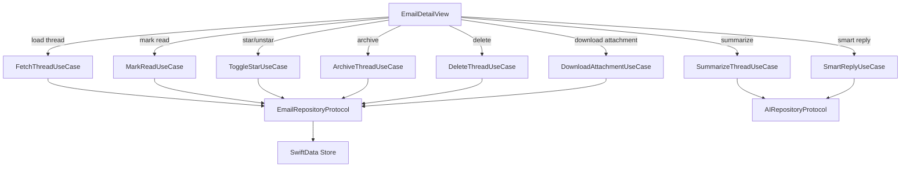

# Specification: Email Detail

> The key words **MUST**, **MUST NOT**, **REQUIRED**, **SHALL**, **SHALL NOT**, **SHOULD**, **SHOULD NOT**, **RECOMMENDED**, **MAY**, and **OPTIONAL** in this document are to be interpreted as described in RFC 2119.

## 1. Summary

This specification defines the email detail screen — the threaded conversation view. It covers message display with expand/collapse, HTML rendering safety with sanitization and tracking protection, attachment handling with security, thread-level actions (reply, star, archive, delete), large thread pagination, and integration points for AI-generated summaries and smart reply suggestions.

---

## 2. Goals and Non-Goals

### Goals

- **G-01**: Display full threaded conversation with all messages in chronological order, supporting expand/collapse
- **G-02**: Safely render HTML email content with sanitization, no scripts, no tracking pixels (privacy-first per Constitution P-01)
- **G-03**: Secure attachment handling — no auto-download, no auto-execute, sandboxed preview (per Constitution P-07)
- **G-04**: Display AI-generated thread summaries and smart reply suggestions (per Foundation G-04)
- **G-05**: Full accessibility: VoiceOver, Dynamic Type, WCAG 2.1 AA compliance (per Constitution TC-05)
- **G-06**: Thread-level actions: reply, reply-all, forward, star, archive, delete with optimistic updates

### Non-Goals

- **NG-01**: Email editing or inline reply composition (handled by Email Composer spec)
- **NG-02**: Phishing detection or URL reputation scoring (deferred to V2)
- **NG-03**: Email printing (deferred to V2)
- **NG-04**: Inline image download for HTML emails (deferred to V2, per Email Sync FR-SYNC-01)

---

## 3. Functional Requirements

### FR-ED-01: Thread Display

**Description**

The client **MUST** display the full thread with all messages in chronological order. Each message **MUST** show: sender name + avatar, recipients (To, CC), timestamp, full body (HTML rendered or plain text), and attachment list with download option.

**Message Content**

Each message within the thread **MUST** display the following:

| Element | Source Field | Display Rules |
|---------|-------------|---------------|
| Sender avatar | `Email.fromAddress` | Initials + generated color (consistent with thread list avatars) |
| Sender name | `Email.fromName` | Full name; fall back to email address if name unavailable |
| Recipients | `Email.toAddresses`, `Email.ccAddresses` | "To: name1, name2" and "CC: name1" — collapsed by default, expandable |
| Timestamp | `Email.dateReceived` or `Email.dateSent` | Relative format matching thread list: "2:30 PM", "Yesterday", "Feb 5", etc. |
| Body | `Email.bodyHTML` or `Email.bodyPlain` | HTML rendered via WKWebView (see FR-ED-04); plain text with preserved line breaks if no HTML |
| Attachments | `Attachment` entities | Inline attachment list per message (see FR-ED-03) |
| Star indicator | `Email.isStarred` | Star icon per message; tappable to toggle |

**Expand/Collapse Behavior**

- The client **MUST** allow expanding/collapsing individual messages within the thread.
- The client **SHOULD** collapse read messages by default, expanding the latest unread message.
- If all messages are read, the latest message **MUST** be expanded.
- Collapsed messages **MUST** display: sender name, timestamp, and a one-line snippet.
- Tapping a collapsed message **MUST** expand it.

**Mark-as-Read Behavior**

- Opening a thread **MUST** mark all unread messages as read via `MarkReadUseCase` (which triggers `STORE +FLAGS (\Seen)` per Email Sync FR-SYNC-10).
- Mark-as-read **MUST** be applied optimistically (update local state immediately) and synced to server asynchronously.
- If server sync fails, the local read state **MUST** revert and an error toast **MUST** be displayed (per Email Sync FR-SYNC-05).
- Mark-as-read **MUST** occur immediately when the thread opens — no delay.

**Quoted Text Handling**

- The client **MUST** detect quoted text in email bodies (reply chains). Detection **MUST** use standard reply markers: `>` prefix lines in plain text, `<blockquote>` elements in HTML, and Gmail-style `
` containers. Detection **SHOULD** also handle Outlook-style `
` / `
` and Apple Mail `
` markers where feasible.
- Quoted text **SHOULD** be collapsed by default with a "Show quoted text" expander.
- Expanding quoted text **MUST NOT** require a network request.

**Thread Actions**

The client **MUST** support the following actions from the email detail screen:

| Action | Trigger | Use Case | IMAP Operation | Undo |
|--------|---------|----------|---------------|------|
| Reply | Tap reply button | — (navigates to Composer) | — | — |
| Reply All | Tap reply-all button | — (navigates to Composer) | — | — |
| Forward | Tap forward button | — (navigates to Composer) | — | — |
| Star/Unstar | Tap star icon | `ToggleStarUseCase` | FR-SYNC-10 `\Flagged` | Immediate toggle (no undo needed) |
| Archive | Tap archive in toolbar | `ArchiveThreadUseCase` | FR-SYNC-10 Archive Behavior | 5-second undo toast; navigate back to thread list |
| Delete | Tap delete in toolbar | `DeleteThreadUseCase` | FR-SYNC-10 Delete Behavior | 5-second undo toast; navigate back to thread list |
| Mark Unread | Overflow menu | `ToggleReadUseCase` | FR-SYNC-10 `\Seen` | Navigate back to thread list |

- All flag/state actions **MUST** apply optimistically and sync to server per Email Sync FR-SYNC-10.
- If server sync fails, the client **MUST** revert the local state and display an error toast: "Couldn't [action]. Tap to retry." (per Email Sync FR-SYNC-05).

**Archive Semantics (Multi-Label Model)**

Archive operates on the **current folder context**, not globally across all labels:

- Archive **MUST** remove only the `EmailFolder` association for the folder the user is currently viewing (e.g., Inbox). The `Email` entity itself **MUST** be retained (per Email Sync FR-SYNC-10 Archive Behavior).
- If the email exists in other synced folders (e.g., Inbox + Starred), archiving from Inbox removes only the Inbox association — the email remains visible under Starred.
- Server-side, archive is implemented as `COPY` to `[Gmail]/All Mail`, then `STORE +FLAGS (\Deleted)` and `EXPUNGE` from the source folder (per Email Sync FR-SYNC-10).
- Since `[Gmail]/All Mail` is not synced locally (per Email Sync FR-SYNC-01), the local result is a deleted `EmailFolder` association. The email remains in the local database for thread context, search, and the virtual Archive view.
- The "Archive" view is a virtual query: emails with no remaining synced-folder associations that are not deleted or trashed.

**Delete Semantics**

- Delete **MUST** move the thread to Trash via `COPY` to `[Gmail]/Trash`, then `STORE +FLAGS (\Deleted)` and `EXPUNGE` from the source folder (per Email Sync FR-SYNC-10).
- If already in Trash, delete **MUST** permanently delete via `STORE +FLAGS (\Deleted)` and `EXPUNGE` (two-level delete).

**View States**

The email detail screen **MUST** handle the following states:

| State | Display |
|-------|---------|
| Loading | Centered `ProgressView` with "Loading conversation…" text |
| Loaded | Scrollable message thread |
| Error (load failed) | Full-screen error with "Couldn't load this conversation" message + "Retry" button |
| Offline (body not cached) | Inline "You're offline" banner + "Message body not available offline" placeholder for uncached messages; cached messages still shown |
| Empty (0 messages — defensive) | Error state — thread with no messages should not exist; display "This conversation appears empty" + back navigation |

**Error Handling**

- If thread data fails to load from the local store, the client **MUST** display the error state with a retry action.
- If mark-as-read fails on the server, the client **MUST** revert the read state locally and show an error toast.
- If a thread action (archive, delete) fails, the client **MUST** cancel the back-navigation, revert the optimistic update, and display an error toast with retry.

### FR-ED-02: AI Integration Points

**Description**

- The client **MUST** display an AI-generated thread summary at the top of the thread (generated on demand or cached). See AI Features spec.
- The client **MUST** display smart reply suggestions at the bottom of the thread. See AI Features spec.

**Async Loading**

- The client **MUST NOT** block thread display while waiting for AI results. AI content **MUST** load asynchronously and appear when ready.
- The summary area **SHOULD** show a subtle loading indicator while AI is processing.
- Smart reply suggestions **SHOULD** appear with a fade-in animation when ready.

**Fallback Behavior**

- If AI summary generation fails or is unavailable (model not downloaded, device unsupported per Foundation Section 11), the summary section **MUST** be hidden entirely (not show an error).
- If smart reply generation fails or is unavailable, the suggestion area **MUST** be hidden entirely.
- The absence of AI features **MUST NOT** degrade the core email reading experience.

### FR-ED-03: Attachment Handling

**Description**

- The client **MUST** display attachment metadata (name, type, size) inline with each message.
- The client **MUST** support downloading attachments to local storage on explicit user action (tap).
- The client **MUST** support previewing common attachment types (images, PDFs) via system QuickLook (sandboxed).
- The client **MUST** support sharing attachments via the system share sheet.

**Attachment Security**

- The client **MUST NOT** auto-download any attachment regardless of size. All attachments require explicit user tap to download.
- The client **MUST NOT** auto-open or auto-execute any attachment after download.
- Attachment previews **MUST** use the system QuickLook framework, which provides sandboxed rendering.
- The client **MUST** display a security warning before downloading executable or potentially dangerous file types:

  | File Extensions | Warning |
  |----------------|---------|
  | `.exe`, `.bat`, `.cmd`, `.com`, `.msi` | "This file is a Windows executable." |
  | `.app`, `.command`, `.sh`, `.pkg`, `.dmg` | "This file can run code on your Mac." |
  | `.js`, `.vbs`, `.wsf`, `.scr` | "This file is a script that can run code." |
  | `.zip`, `.rar`, `.7z`, `.tar.gz` | "This archive may contain executable files." |
  | `.apk` | "This file is an Android application package." |

- The client **MUST NOT** execute attachments directly. Opening an attachment **MUST** delegate to the system handler (e.g., Finder, default app).
- Downloaded attachment files **MUST** be stored within the app's sandbox directory, not in shared locations.

**Cellular Download Warning** (cross-ref Email Sync FR-SYNC-08)

- For attachments ≥ 25 MB, the client **MUST** display a warning before download on cellular networks: "This attachment is [size]. Download on cellular?"
- The warning **MUST** include "Download" and "Cancel" options.
- The cellular warning **MUST** be displayed in addition to (not instead of) the security warning for dangerous file types.

**Inline Images (CID References)**

- Inline images referenced via `cid:` scheme in HTML emails are **not** downloaded during sync (per Email Sync FR-SYNC-01).
- In V1, `cid:` images **MUST** display a placeholder with an indication that inline images are not available.
- `cid:` images **MUST NOT** be treated as remote content — they are not tracking pixels and **MUST NOT** be counted in the tracker count.

**Download Progress & Error Handling**

- Attachment download **MUST** display a progress indicator (determinate if `sizeBytes` is known, indeterminate otherwise).
- If download fails after retries (per Email Sync FR-SYNC-08: 3 retries with exponential backoff), the client **MUST** show an error with a "Retry" button.
- If the download is cancelled by the user, partially downloaded data **MUST** be cleaned up (delete partial file, reset `isDownloaded = false`).
- Successful download **MUST** update `Attachment.isDownloaded = true` and `Attachment.localPath` to the sandbox path.

### FR-ED-04: HTML Rendering Safety

Email HTML is untrusted content. The client **MUST** sanitize and restrict HTML rendering to prevent privacy leaks, tracking, and code execution.

**Remote Content Blocking**

- The client **MUST** block all remote content (images, CSS, fonts, iframes) by default.
- Blocked remote images **MUST** display a placeholder with an indication that images were blocked.
- The client **MUST** provide a per-message "Load Remote Images" action.
- The client **SHOULD** provide a per-sender "Always Load Remote Images" preference (stored locally).
- When remote images are blocked, no network requests for those resources **SHALL** be made.

**Per-Sender "Always Load Remote Images"**

- The preference **MUST** be keyed by sender email address (exact match, not domain).
- The preference **MUST** be stored locally in SwiftData as a `TrustedSender` entity (not synced via IMAP).
- When a trusted sender's email is displayed, remote images **MUST** be loaded automatically (tracking pixels are still stripped — see below).
- The user **MUST** be able to manage these preferences in Settings → Privacy → Trusted Senders.
- The trusted senders list **MUST** support: remove individual entries, clear all.

**Tracking Pixel Detection**

- The client **MUST** detect and strip likely tracking pixels before rendering, even when remote images are allowed:
  - Images with dimensions 1x1 or 0x0 (in `width`/`height` attributes or inline CSS)
  - Images with URLs matching known tracking domains (maintain a local blocklist)
  - Images embedded in visually hidden elements (`display:none`, `visibility:hidden`, `opacity:0`)
- Stripped tracking pixels **MUST NOT** generate any network request.
- The client **SHOULD** display a count of blocked trackers per message (e.g., "3 trackers blocked").

**Tracking Pixel Blocklist Maintenance**

- The tracking domain blocklist **MUST** be bundled as a static JSON file in the app bundle. The same blocklist file **MUST** be shared across iOS and macOS targets (single source of truth in the SPM package).
- Updates to the blocklist **MUST** be shipped via app updates (no remote fetch — per Constitution P-02, the client must not connect to third-party servers).

**HTML Sanitization**

The following elements and attributes **MUST** be stripped or neutralized before rendering:

| Removed | Reason |
|---------|--------|
| `<script>`, `<noscript>` | Code execution |
| `<iframe>`, `<frame>`, `<frameset>` | External content embedding |
| `<object>`, `<embed>`, `<applet>` | Plugin/code execution |
| `<form>`, `<input>`, `<button>`, `<select>`, `<textarea>` | Phishing form submission |
| `<meta http-equiv="refresh">` | Automatic redirect |
| `<link rel="stylesheet">` (external) | Remote resource loading |
| `@import` in CSS | Remote CSS loading |
| Event handler attributes (`onclick`, `onerror`, `onload`, `onmouseover`, etc.) | Code execution |
| `javascript:` URI scheme in `href`, `src`, `action` | Code execution |
| `data:` URI scheme (except for inline images in `` tags) | Content injection |

**Rendering Constraints**

- HTML **MUST** be rendered in a `WKWebView` with JavaScript **disabled** (`javaScriptEnabled = false`).
- All hyperlinks **MUST** open in the system default browser, never navigated within the WKWebView.
- The WKWebView **MUST** have no access to the app's cookies, local storage, or network session.
- If sanitization fails or produces empty output, the client **MUST** fall back to rendering the plain text body.

**Link Safety**

- When a link's displayed text differs from its `href` URL (potential phishing), the client **SHOULD** display the actual destination URL in a tooltip or popover before navigation.
- On iOS, long-press on a link **MUST** show a preview with the destination URL via standard link preview behavior.
- On macOS, hover over a link **SHOULD** display the destination URL in a status bar or tooltip.
- Links using `javascript:`, `data:`, or other non-`http`/`https` schemes **MUST** be neutralized during sanitization (see table above).

### FR-ED-05: Large Thread Handling

**Description**

For threads with a large number of messages, the client **MUST** paginate to maintain performance and prevent memory issues.

**Pagination Rules**

- For threads with more than 50 messages, the client **MUST** initially load and display only the most recent 25 messages.
- A "Show earlier messages" button **MUST** appear at the top of the thread to load the next batch of 25.
- The most recent unread message **MUST** always be included in the initial load, regardless of its position in the thread.
- Loading earlier messages **MUST NOT** reset the scroll position — the user's current position **MUST** be preserved.
- The client **MUST** handle threads up to 500 messages without OOM or crashes.
- Scroll performance within a large thread **MUST** remain acceptable (no visible jank).

**Error Handling**

- If loading additional messages fails, the "Show earlier messages" button **MUST** display an error with a "Retry" option. Previously loaded messages **MUST** remain visible.

---

## 4. Non-Functional Requirements

### NFR-ED-01: Email Open Time

- **Metric**: Time from tap to content visible (cached email)
- **Target**: < 300ms
- **Hard Limit**: 500ms
- **Measurement**: Time interval from thread row tap to first message content rendered on iPhone SE 3rd gen
- **Note**: This measures local data fetch and rendering only. Network sync time is covered by Email Sync NFR-SYNC-01.

### NFR-ED-02: Large Thread Handling

- **Metric**: Performance and stability with 100+ message threads
- **Target**: Smooth scrolling, no visible jank
- **Hard Limit**: No OOM crash; must paginate at 50+ messages (see FR-ED-05)
- **Measurement**: Load a 100-message thread on iPhone SE 3rd gen; scroll through all messages. Memory must not exceed 200 MB above baseline.

### NFR-ED-04: HTML Sanitization Performance

- **Metric**: Time to sanitize a single HTML email body
- **Target**: < 50ms
- **Hard Limit**: 200ms
- **Measurement**: Time to sanitize an average HTML email (50 KB body) on iPhone SE 3rd gen
- **Failure Threshold**: Fails if > 200ms on 10 consecutive emails

### NFR-ED-03: Accessibility

- **WCAG 2.1 AA**: All UI elements **MUST** meet WCAG 2.1 AA contrast ratios (4.5:1 for normal text, 3:1 for large text/icons) per Constitution TC-05.
- **VoiceOver**: Each message **MUST** be navigable as a unit. VoiceOver **MUST** announce: sender name, timestamp, read/unread status, and provide custom actions (expand/collapse, reply, star). Attachments **MUST** be individually accessible with labels announcing name, size, and download state.
- **Dynamic Type**: All non-HTML text (sender name, timestamp, subject, recipient lists, attachment labels) **MUST** scale with Dynamic Type from accessibility extra small through accessibility 5 (xxxLarge). HTML content in WKWebView **SHOULD** respect the user's preferred text size by injecting a CSS `font-size` override based on the Dynamic Type setting. Layout **MUST NOT** break or clip at any supported size.
  - **Implementation note**: WKWebView does not automatically inherit iOS Dynamic Type settings. The implementation **MUST** observe `UIContentSizeCategory.didChangeNotification` and re-inject the CSS font-size override (or reload the web view content) when the user changes their text size setting.
- **Color Independence**: Read/unread status, star indicator, and attachment download state **MUST** use shape/icon in addition to color — color **MUST NOT** be the sole indicator.
- **Reduce Motion**: Message expand/collapse animations **SHOULD** use cross-dissolve instead of slide when "Reduce Motion" is enabled.

---

## 5. Data Model

Refer to Foundation spec Section 5 for Email, Thread, and Attachment entities. This feature reads Thread + Email + Attachment entities. Key fields consumed:

| Field | Entity | Usage |
|-------|--------|-------|
| `subject` | Thread | Thread title / navigation bar title |
| `latestDate` | Thread | — |
| `messageCount` | Thread | Message count display, pagination trigger |
| `unreadCount` | Thread | Mark-as-read trigger on open |
| `participants` | Thread | Participant list (header display) |
| `aiSummary` | Thread | AI summary display (FR-ED-02) |
| `fromName`, `fromAddress` | Email | Sender display per message |
| `toAddresses`, `ccAddresses` | Email | Recipient display per message |
| `bodyHTML`, `bodyPlain` | Email | Message body rendering (FR-ED-04 / FR-ED-01) |
| `dateReceived`, `dateSent` | Email | Per-message timestamp |
| `isRead`, `isStarred` | Email | Status indicators + actions |
| `filename`, `mimeType`, `sizeBytes` | Attachment | Attachment metadata display |
| `isDownloaded`, `localPath` | Attachment | Download state + preview path |

**Additional Feature-Local Entity: TrustedSender**

| Field | Type | Description |
|-------|------|-------------|
| `id` | String (PK) | Unique identifier |
| `senderEmail` | String | Sender email address (exact match key) |
| `createdDate` | Date | When the preference was created |

The `TrustedSender` entity is a **feature-local entity** introduced by this spec (not defined in Foundation Section 5). It stores per-sender "Always Load Remote Images" preferences (FR-ED-04). Storage: SwiftData `@Model` in the same `ModelContainer` as Foundation entities, but owned by this feature. It is local-only — not synced via IMAP, not shared with other features.

---

## 6. Architecture Overview

Refer to Foundation spec Section 6. This feature uses:

**Note**: Per project architecture (CLAUDE.md), this feature uses the MV (Model-View) pattern with `@Observable` services and SwiftUI native state management. No ViewModels — view logic is in the SwiftUI views using `@State`, `@Environment`, and `.task` modifiers. Per Foundation FR-FOUND-01, views **MUST** call domain use cases only — never repositories directly.

**Feature-Specific Use Cases**: The Foundation architecture diagram (Section 6) defines 8 core use cases (`SyncEmailsUseCase`, `FetchThreadsUseCase`, `SendEmailUseCase`, etc.). This feature introduces additional **feature-specific use cases** for email detail operations: `MarkReadUseCase`, `ToggleStarUseCase`, `ToggleReadUseCase`, `ArchiveThreadUseCase`, `DeleteThreadUseCase`, and `DownloadAttachmentUseCase`. These follow the same domain layer pattern (use case → repository) and are scoped to the Email Detail feature module. `FetchThreadUseCase`, `SummarizeThreadUseCase`, and `SmartReplyUseCase` are shared with Foundation.

---

## 7. Platform-Specific Considerations

### iOS

- **Navigation**: Full-screen push from thread list via `NavigationStack`. Back button returns to thread list.
- **Actions toolbar**: Bottom toolbar with reply, reply-all, forward buttons. Overflow menu (⋯) for archive, delete, mark unread, move.
- **Star**: Star icon in the navigation bar or inline per message, tappable to toggle.
- **Swipe gestures**: Individual messages do **not** support swipe gestures — thread-level actions only via toolbar/overflow.
- **Adaptive layout**: **MUST** support iPhone SE (375pt width) through iPhone Pro Max (430pt width). Message bubbles **MUST** use full width minus safe area insets. Both portrait and landscape orientations **MUST** be supported (per Foundation Section 7.1).
- **Share sheet**: System share sheet for attachments, accessible via share button on each attachment.
- **Link preview**: Long-press on a link **MUST** show the standard iOS link preview with destination URL.

### macOS

- **Layout**: Right pane of `NavigationSplitView` three-pane layout. Thread detail fills the right pane.
- **Keyboard shortcuts** (per Foundation Section 7.2):
  - `⌘R` — Reply to selected/latest message
  - `⌘⇧R` — Reply All
  - `⌘⇧F` — Forward
  - `⌘⌫` — Delete thread
  - `⌘⇧A` — Archive thread
  - `⌘⇧U` — Toggle read/unread
  - `↑` / `↓` — Navigate between messages within the thread
  - `⏎` — Expand/collapse selected message
- **Context menu**: Right-click on a message shows: Reply, Reply All, Forward, Copy, Star/Unstar.
- **Drag-and-drop**: Downloaded attachments **MUST** support drag-and-drop to Finder or other apps (per Foundation Section 7.2).
- **Hover**: Links show destination URL on hover via tooltip or status bar.
- **Toolbar**: macOS toolbar with reply, reply-all, forward, archive, delete, star buttons.

---

## 8. Alternatives Considered

| Alternative | Pros | Cons | Rejected Because |
|-------------|------|------|-----------------|
| Native HTML rendering (no sanitization) | Richer display | Security/privacy risk | Unacceptable for privacy-first client |
| Plain text only | Maximum safety | Loses formatting | Most modern emails require HTML |
| Embedded browser (full WebView) | Full fidelity | JS execution risk | Must disable JS per security requirements |
| SFSafariViewController for HTML | Full rendering fidelity | No sanitization control; runs JS | Must disable JS for security; no control over content |
| SwiftUI `Text` with AttributedString | No WKWebView overhead | Cannot render complex HTML emails | Most emails require full HTML rendering |
| Download all attachments on sync | Faster preview experience | Storage explosion; privacy concern | Constitution TC-06 limits; Email Sync FR-SYNC-08 requires lazy download |
| Mark-as-read after 3-second delay | Prevents accidental marking | Confusing if user leaves quickly | Immediate marking is standard UX; undo via "Mark Unread" |

---

## 9. Open Questions

None — all resolved.

---

## 10. Revision History

| Version | Date | Author | Change Summary |
|---------|------|--------|---------------|
| 1.0.0 | 2025-02-07 | Core Team | Extracted from monolithic spec v1.2.0 section 5.4. Includes HTML Rendering Safety (5.4.3) and expanded Attachment Security (5.4.2). |
| 1.1.0 | 2026-02-07 | Core Team | Review round 1: Added G-XX/NG-XX IDs (SF-03). Expanded FR-ED-01 with message content table, mark-as-read behavior (via MarkReadUseCase + FR-SYNC-10), quoted text handling, thread actions table with use case routing, view states (loading/loaded/error/offline/empty), error handling. Expanded FR-ED-02 with async loading, fallback hiding. Expanded FR-ED-03 with cellular download warning (FR-SYNC-08 cross-ref), CID inline image handling (V1 placeholder), download progress/error/cancel, `.apk` in dangerous extensions. Expanded FR-ED-04 with link safety (phishing URL display), per-sender "Always Load" preferences (TrustedSender entity), tracking blocklist maintenance (bundled JSON, no remote fetch per P-02). Added FR-ED-05 (large thread pagination: 50+ messages paginate in batches of 25). Expanded NFR-ED-01 with measurement method. Expanded NFR-ED-02 with measurable targets (200MB memory limit). Added NFR-ED-03 (Accessibility: WCAG 2.1 AA, VoiceOver, Dynamic Type with CSS injection for WKWebView, color independence, Reduce Motion). Expanded Data Model with field usage table and TrustedSender entity. Replaced architecture section with Mermaid diagram showing 8 use cases (FR-FOUND-01 compliance). Added MV pattern note (no ViewModels). Expanded iOS platform section (toolbar, adaptive layout, link preview). Expanded macOS section (keyboard shortcuts, context menu, drag-and-drop, hover, toolbar). Added 4 new alternatives considered. |
| 1.2.0 | 2026-02-07 | Core Team | Review round 2 (lock): Cleared Open Questions (SF-03 lock requirement). Added explicit archive/delete semantics for Gmail multi-label model (current-folder-context archive, two-level delete). Marked TrustedSender as feature-local entity with SwiftData storage scope. Documented feature-specific use cases (MarkReadUseCase, ToggleStarUseCase, etc.) as extensions of Foundation architecture. Added Outlook/Apple Mail quoted text markers. Clarified tracking blocklist shared across iOS/macOS targets. Added Dynamic Type WKWebView implementation note (UIContentSizeCategory observation). Added NFR-ED-04 (HTML sanitization performance: <50ms target, 200ms hard limit). Status → locked. |
