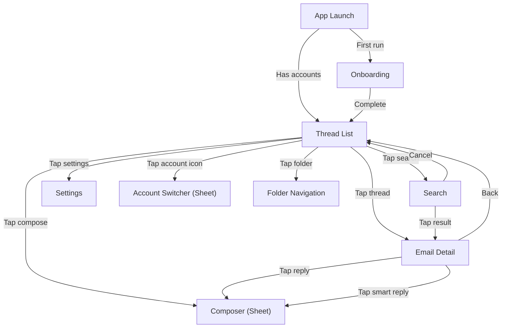

# Thread List — iOS/macOS Implementation Plan

---

## 1. Scope

This plan covers the thread list screen implementation: navigation structure, thread list view, thread row component, gestures, folder navigation, account switcher, and Outbox display. It is the first UI feature and the primary user-facing screen.

---

## 2. Platform Context

Refer to Foundation plan Section 2 for OS versions, device targets, and platform guidelines.

---

## 3. Architecture Mapping

### iOS Navigation Flow



### iOS Thread Row Layout

```
┌──────────────────────────────────────────────────────────┐
│ [Avatar] Sender Name              2:30 PM  [★] [📎]     │
│          Subject line goes here...          [Primary]    │
│          Snippet of the latest message in this thread... │
│          ● (unread indicator)                            │
└──────────────────────────────────────────────────────────┘
```

### Files

| File | Layer | Purpose |
|------|-------|---------|
| `NavigationRouter.swift` | Presentation/Navigation | Route definitions, navigation state (@Observable) |
| `ThreadListView.swift` | Presentation/Views | Main thread list screen (uses @State, @Environment, .task) |
| `ThreadRowView.swift` | Presentation/Views | Individual thread row component |
| `FolderSidebarView.swift` | Presentation/Views | Folder navigation list (system folders + labels + Outbox) |
| `AccountSwitcherView.swift` | Presentation/Views | Multi-account switcher sheet |
| `AvatarView.swift` | Presentation/Components | Sender avatar (initials + generated color) |
| `CategoryTabBar.swift` | Presentation/Components | Horizontal category filter tabs with badges |
| `CategoryBadgeView.swift` | Presentation/Components | AI category pill badge |
| `OutboxRowView.swift` | Presentation/Views | Outbox item row (send state + retry/cancel) |

**Note**: Per CLAUDE.md, this feature uses the MV (Model-View) pattern. No ViewModels — view logic uses `@State`, `@Environment`, `@Observable` services, and `.task` modifiers.

---

## 4. Implementation Phases

| Task ID | Description | Spec FRs | Dependencies |
|---------|-------------|----------|-------------|
| IOS-U-01 | iOS navigation structure + router | FR-TL-05 | Phase 1 (Foundation + Account Management + Email Sync) |
| IOS-U-02 | Thread list view + state management | FR-TL-01, FR-TL-02 | IOS-U-01, IOS-F-10 (Email Sync) |
| IOS-U-03 | Thread row component (avatar, snippet, badges) | FR-TL-01 | IOS-U-02 |
| IOS-U-04 | Pull-to-refresh + swipe actions + multi-select | FR-TL-03 | IOS-U-02 |
| IOS-U-05 | Folder navigation + Outbox view | FR-TL-04 | IOS-U-02 |
| IOS-U-12 | Account switcher + unified inbox | FR-TL-04 | IOS-U-02 |

---

## 5. Risks and Mitigations

| Risk | Likelihood | Impact | Mitigation |
|------|-----------|--------|------------|
| Thread list scroll jank with 500+ threads | Medium | High | Use LazyVStack, avoid complex view recomputations, profile with Instruments early |
| Pagination cursor edge cases (concurrent sync + scroll) | Medium | Medium | Use SwiftData `@Query` with `FetchDescriptor` sorting by `latestDate`; stable cursor via date + ID |
| AI category not available at launch | High | Low | Hide category tabs entirely when AI unavailable; all threads in single list |
| Dynamic Type breaking layout at largest sizes | Medium | Medium | Test all accessibility sizes early; use flexible layout with `.lineLimit` and truncation |
